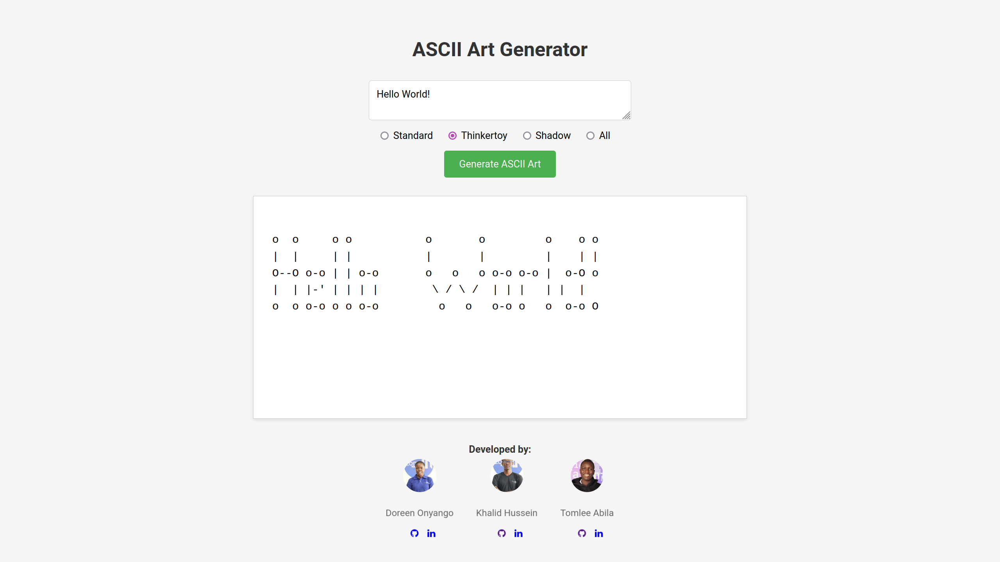

# ASCII Art Web

This is a program that generates ASCII art based on a given string and banner style specified. The program uses a web interface to displays the results.

## Features

- Converts strings into ASCII art
- Supports numbers, letters, spaces, special characters, and newline characters ('\n')
- Utilizes specific graphical templates for ASCII representation
- Interactive web view: GUI (graphical user interface)

## Installation

This program is written purely in [Go](https://go.dev) language for the backend, before you think of running it, please make sure to have Go installed on your system.

1. Clone the repository:

    ```bash
    git clone https://learn.zone01kisumu.ke/git/khahussein/ascii-art-web.git
    ```

2. Navigate to the project directory:

    ```bash
    cd ascii-art-web/
    ```

## Usage

Run the below command to start the server, then use the web browser to interact with the system [localhost](http://localhost:8080)

```bash
go run .
```

## Example

Type something in the text area provided and should display some output


<!-- Screenshot of our web interface: shows example of the UI -->

## Test

start the server with the above usage command and run the below command to test the program's functionality

```bash
curl -X POST -d "Text=Hello World&Banner=standard" http://localhost:8080/ascii-art
```

## Implementation

Below is the function that handles requests and responses. This extract specifically displays the data based on the banner file selected and if the 'all' button is selected it displays data based on all the banner files.

```go
func AsciiServer(w http.ResponseWriter, r *http.Request) {
    {...}
	all := []string{"standard", "thinkertoy", "shadow"}

	if banner == "all" {
		for i, bn := range all {
			if i != 0 {
				str += "\n"
			}
			str += writeAscii(w, bn, text)
		}
	} else {
		str += writeAscii(w, banner, text)
	}

    {...}
    fmt.Fprint(w, str)
```    

## File Formats

- `standard.txt`: Standard ASCII character set
- `shadow.txt`: Shadowed ASCII character set
- `thinkertoy.txt`: ASCII character set with thinkertoy style

## File Integrity Verification

This program ensures file integrity using SHA-256 checksums. When downloading or verifying files (standard.txt, shadow.txt, thinkertoy.txt), it calculates the checksum of the downloaded file and compares it with a pre-defined expected checksum (expectedChecksum map). If the checksums do not match, it indicates that the file has been tampered with or corrupted.

## Contributing

If you have suggestions for improvements, bug fixes, or new features, feel free to open an issue or submit a pull request.

## Authors

This project was build and maintained by:

 * [Doreen Onyango][doonyango]
 * [Khalid Hussein][khahussein]
 * [Tomlee Abila][tabila]

[khahussein]: https://github.com/kherldhussein
[doonyango]: https://github.com/Doreen-Onyango
[tabila]: https://github.com/Tomlee-abila